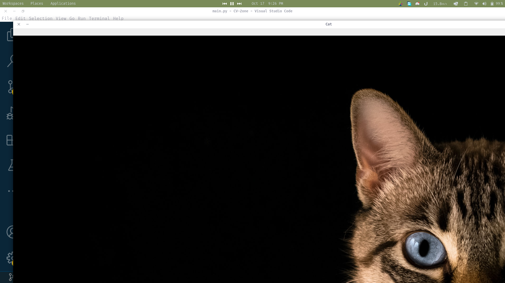
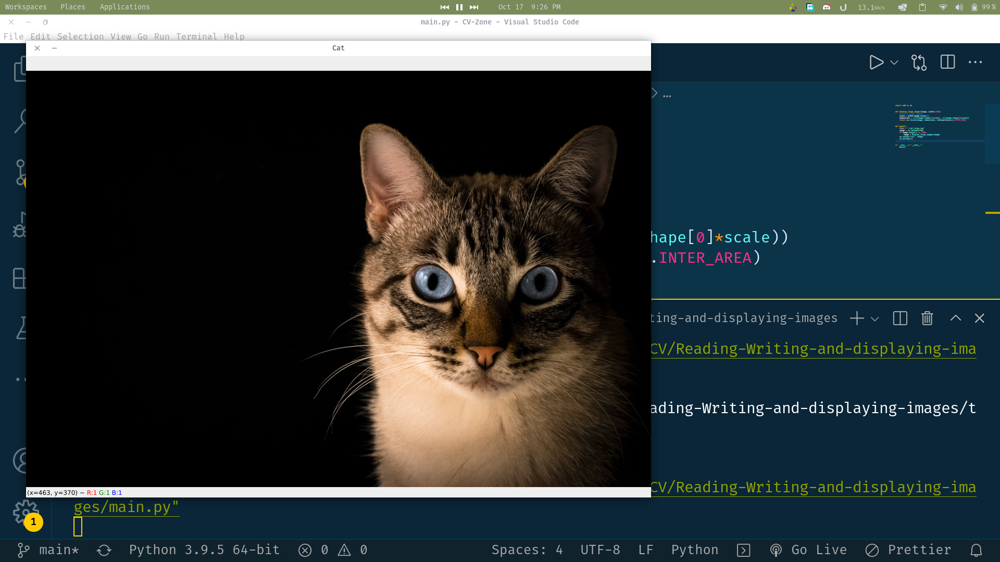

# Reading and Writing 
The code opens the file, and if the file is too big to fit on the screen, it scales it down using the cv.resize function. 
For example, this image gets towned down from

to 
