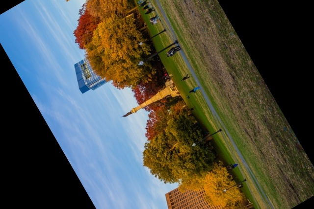
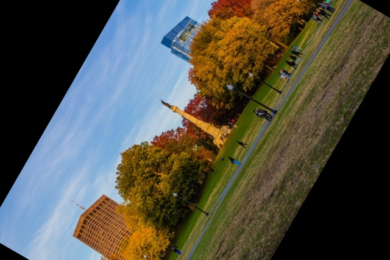

# Rotating Images
A python code to rotate images. The code can rotate the image, from any point, and  if we don't provide the center for rotation, it assumes the center of the image to be the center of rotation. 

### Original Image

## Rotated Images

