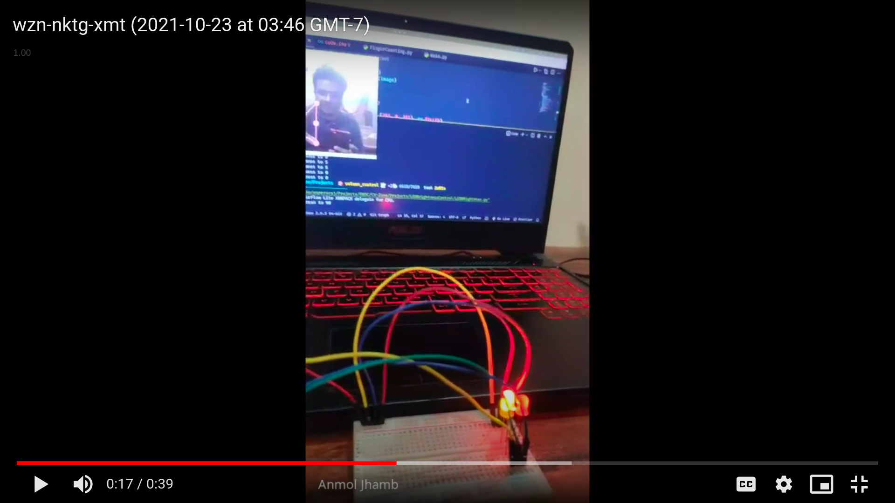

# Control LED Brightness using Hand Gestures
In this project, we are measuring the distance between the tip of the thumb, and the tip of the index finger, and mapping that value to 0 to 100, which would be the percentage that we want our brightness to be.

You can checkout the demo video <a href="https://drive.google.com/file/d/1L4s7kEqg8ffhjla3IckL6n20zD8Qv22V/view?usp=sharing">here</a>